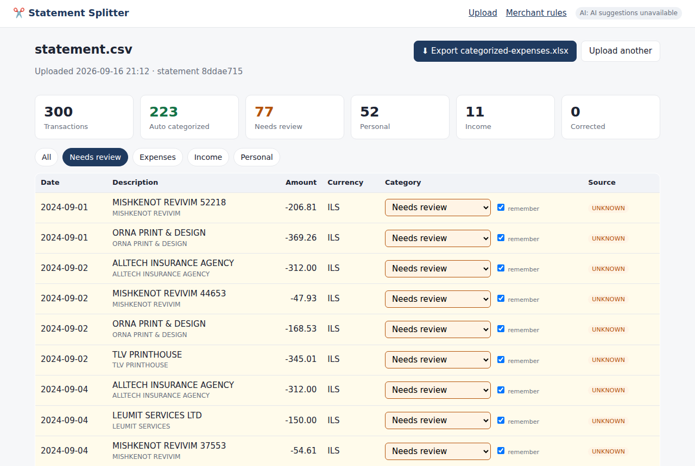

# Statement Splitter

**Turn messy bank statements into categorized expense reports — and teach the app your merchants as you go.**

Upload a bank statement → review categories → export a clean expense report.

[](https://github.com/VsevaTech/statement-splitter/actions/workflows/ci.yml)




## The problem

Freelancers, sole traders and small businesses get a CSV/XLSX export from their bank with hundreds of lines like

```
GOOGLE*GSUITE 839291
AWS EMEA 20481123
WOLT IL 551020
PARTNER COMMUNICATION 118203
CERCLI LTD 778812
UBER *TRIP 990112
```

and then spend an evening deciding, line by line, whether each one is *Software*, *Communication*, *Food*, *Transport*, a *bank fee*, *taxes* or just *personal*. Next month they do it again — for the same merchants.

Statement Splitter categorizes most lines automatically, puts the unknown ones in a short review queue, and **remembers every correction per merchant**, so the next statement is mostly done before you open it.

## Features

- **CSV and XLSX import** — any common delimiter (`,` `;` tab `|`), common encodings (UTF‑8, Windows‑1251/1255/1252…), Excel date cells.
- **Automatic column detection** (Date, Description, Amount *or* Debit/Credit, Currency, Dr/Cr indicator) with a fallback **column‑mapping screen** and preview when detection is not confident.
- **Three‑level categorization**: saved merchant rules → built‑in keyword rules → optional AI fallback → *Needs review*.
- **Merchant learning**: correct a category once (or use *Apply to all similar*), and every future statement gets it automatically.
- **Review UI** with summary counters, filters (All / Needs review / Expenses / Income / Personal), inline category dropdowns, bulk apply.
- **XLSX export** with `Transactions` and `Summary` sheets; totals are **per category and per currency** — ILS, USD and EUR are never added together.
- **Optional, privacy‑minded AI** (Gemini Flash free tier). Off by default; works fully offline without a key.
- Single SQLite file, no accounts, no background workers. Runs with `docker compose up`.

## Quick start

### Docker (recommended)

```bash
git clone https://github.com/VsevaTech/statement-splitter.git
cd statement-splitter
docker compose up --build
# open http://localhost:8000 and upload demo-data/statement.xlsx
```

### Local (Python 3.12+)

```bash
python -m venv .venv && source .venv/bin/activate
pip install -r requirements-dev.txt
cp .env.example .env            # optional — only needed for AI suggestions
uvicorn app.main:app --reload
```

The SQLite database is created at `./data/statement_splitter.db` (or `/data` inside Docker).

## Try the demo

Everything in `demo-data/` is **synthetic** (generated by `scripts/generate_demo_data.py`, deterministic seed):

| File | Layout | Rows |
|---|---|---|
| `statement.csv` | `Date, Description, Amount, Currency` — signed amounts, comma delimiter | 300 |
| `statement.xlsx` | `Transaction Date, Details, Debit, Credit, Currency` — Excel dates | 300 |
| `statement-2.csv` | next month, `;` delimiter, decimal comma, `dd.mm.yyyy` dates | 140 |

Demo script:

1. Upload `statement.xlsx` → **300 transactions detected**, ~75 % categorized automatically (Transport, Food, SaaS, Cloud, Bank fees, Taxes, Income, Personal…).
2. Click **Needs review** → the unknown merchants (`CERCLI`, `DOCUSIGN`, `TLV PRINTHOUSE`, …).
3. Pick *Accounting* for `CERCLI`, *Software / SaaS* for `DOCUSIGN`, *Office* for `TLV PRINTHOUSE` — with **remember** ticked, or press **Apply to all similar** to fix every occurrence at once. Each correction saves a merchant rule (see **Merchant rules**).
4. **Export categorized‑expenses.xlsx**.
5. Upload `statement-2.csv` → the same three merchants are **categorized automatically** with source `rule`.

This scenario is also an automated test: `tests/test_web_flow.py::test_demo_scenario_end_to_end` and `::test_critical_scenario_learned_merchant_applies_to_next_statement`.

## Supported input

- `.csv` / `.txt`: delimiter sniffed from the first lines; encoding detected (UTF‑8 with/without BOM first, then Windows code pages via `charset-normalizer`).
- `.xlsx`: first sheet, via `openpyxl`; dates and numbers are read as typed cells.
- Amounts: `-46.80`, `1,234.56`, `1.234,56`, `1 234,56`, `(12.00)`, `12.00-`, `₪ 45.90`, `12,50 EUR`.
- Either one signed **Amount** column, or separate **Debit / Credit** columns, optionally a **Dr/Cr** indicator column.
- Currency from a column, from a symbol/code inside the amount cell, or a default you choose (ILS by default).

Rows with no parseable amount (balance lines, footers) are skipped.

## Categories

```
Software / SaaS   Cloud / Hosting   Accounting   Communication
Transport         Travel            Office       Food
Bank fees         Taxes             Professional services
Personal          Other             Income (credits)
```

The list is closed: the UI dropdown, the built‑in rules and the AI provider can only use these values (`app/categories.py`).

## How categorization works

```
saved merchant rule  (SQLite, your corrections)      → source: rule     confidence 1.0
credit / incoming    → Income                          → source: income
built-in regex rules (UBER→Transport, AWS→Cloud, …)   → source: builtin  confidence 0.8–0.9
AI fallback          (optional, unknown merchants only)→ source: ai       confidence from model
otherwise            → Needs review                    → source: unknown
```

A saved rule always wins — even over a built‑in rule and even for credits.

### Merchant normalization

`app/normalize.py` turns a raw description into a stable **merchant key**:

```
GOOGLE*GSUITE 839291   →  GOOGLE GSUITE
GOOGLE GSUITE 482901   →  GOOGLE GSUITE
PAYPAL *SPOTIFY        →  SPOTIFY
CERCLI LTD 778812      →  CERCLI
MYSTERY SHOP 42        →  MYSTERY SHOP
```

It removes only clear noise: reference numbers, dates, masked card fragments, payment‑processor prefixes (`PAYPAL *`, `SQ *`…), legal suffixes (`LTD`, `INC`…) and trailing branch numbers. It is deliberately conservative: there is no fuzzy matching, so `WOLT IL` and `WOLT DE` or `GOOGLE GSUITE` and `GOOGLE CLOUD` stay different merchants. Leaving something in review is preferred to merging two different merchants.

### Merchant learning

Changing a category with **remember** ticked, or pressing **Apply to all similar**, stores `merchant_key → category` in the `merchant_rules` table. Rules can be inspected and deleted on the **Merchant rules** page. Untick *remember* for one‑off reclassifications (e.g. one Uber ride that was personal).

## Optional AI

Unknown merchants can be sent to **Gemini Flash** (Google AI Studio free tier) when — and only when — both are true:

1. `GEMINI_API_KEY` is set in the environment / `.env` (`GEMINI_MODEL` defaults to `gemini-2.0-flash`);
2. the **Use AI suggestions** switch is ON (stored in SQLite, **OFF by default**).

Without a key the UI shows `AI suggestions unavailable` and everything else works normally. The response is parsed with a Pydantic schema, categories outside the allowed list are discarded, and suggestions below `AI_MIN_CONFIDENCE` (0.6) stay in *Needs review*. Network errors, timeouts and malformed responses degrade to "no suggestion".

## Privacy

> AI suggestions are optional. Only unknown merchant descriptions are sent to the configured AI provider.

- The uploaded file is parsed in memory and never written to disk. Raw rows are kept in SQLite only until the column mapping is confirmed, then deleted; only the normalized transactions remain (you can delete a statement from the home page at any time).
- Statement contents are never logged; access logs are reduced and AI failures log only the exception class.
- The AI provider receives **normalized merchant keys of unknown merchants only** — no amounts, dates, balances, account details or the full statement. One batched request per upload.
- The API key lives in the environment only — never in the database; `.env` is git‑ignored.
- Tests never call a real AI API (transport is injected).

## XLSX export

`GET /statements/{id}/export` → `categorized-expenses.xlsx`

**Transactions**: `Date | Original Description | Normalized Merchant | Amount | Currency | Direction | Category | Category Source`

**Summary**: `Category | Transaction Count | Total Amount | Currency` — one row per category **and** currency, so a statement with ILS, USD and EUR yields separate totals per currency. Uncategorized lines appear as `Needs review`.

## Architecture

```
app/
  main.py        FastAPI routes (upload → map → review → export), Jinja2 + HTMX
  services.py    use-cases shared by HTTP layer and tests
  importer.py    CSV/XLSX → RawTable (encoding + delimiter detection)
  columns.py     column detection + ColumnMapping model
  parsing.py     amount / date / currency parsers
  transform.py   RawTable + mapping → NormalizedTransaction[]
  normalize.py   merchant key normalization
  rules.py       built-in regex rules
  ai.py          optional Gemini client (injectable transport, Pydantic validation)
  categorize.py  rule > builtin > ai > review pipeline, summary
  export.py      openpyxl workbook (Transactions + per-currency Summary)
  db.py          SQLAlchemy 2 models: MerchantRule, Setting, PendingUpload, Statement, Transaction
  templates/, static/
scripts/generate_demo_data.py   synthetic statements
tests/                          pytest (91 tests), no network
```

Stack: Python 3.12, FastAPI, Pydantic v2, SQLAlchemy 2, SQLite, pandas, openpyxl, Jinja2 + HTMX, httpx, pytest, ruff, Docker.

## Tests

```bash
pytest            # 91 tests, ~2 s, no network / no AI key needed
ruff check .
ruff format --check .
```

Covered: CSV/XLSX import, delimiter and encoding detection, column detection and manual mapping, amount parsing, debit/credit, currencies, merchant normalization, built‑in rules, saved rules (and their priority over built‑ins), unknown merchants, AI disabled / malformed response / timeout / disallowed category, category correction, rule persistence, bulk apply, XLSX export, multi‑currency summary, the full learn‑then‑reupload scenario and the demo scenario.

CI (`.github/workflows/ci.yml`): ruff → pytest → demo‑data reproducibility → Docker build + container smoke test.

## Limitations

- Single‑user, no authentication — run it locally or behind your own proxy.
- Only the first sheet of an XLSX is read; PDF statements are not supported.
- Column detection is heuristic; unusual layouts fall back to manual mapping.
- Built‑in rules are a small, mostly English/Israeli‑flavoured starter set — the app is meant to learn *your* merchants, not to ship a merchant database.
- Merchant normalization is exact‑key, not fuzzy: `GOOGLE GSUITE` and `GOOGLE WORKSPACE` are two merchants until you teach both.
- Amounts are stored as floats rounded to 2 decimals — fine for reports, not for accounting‑grade ledgers.
- No multi‑currency conversion: totals are reported per currency by design.
- AI fallback depends on Gemini free‑tier quotas and returns nothing on rate limits.

## License

MIT — see [LICENSE](LICENSE).
