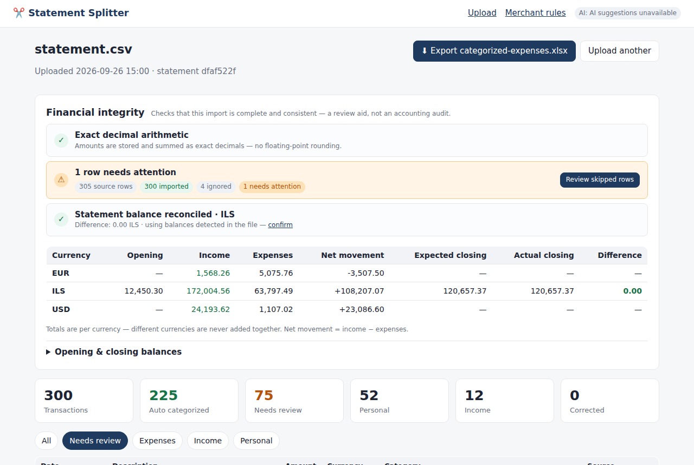
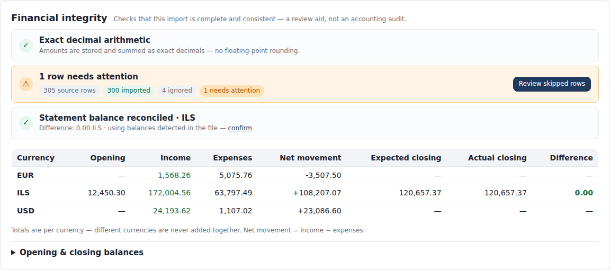
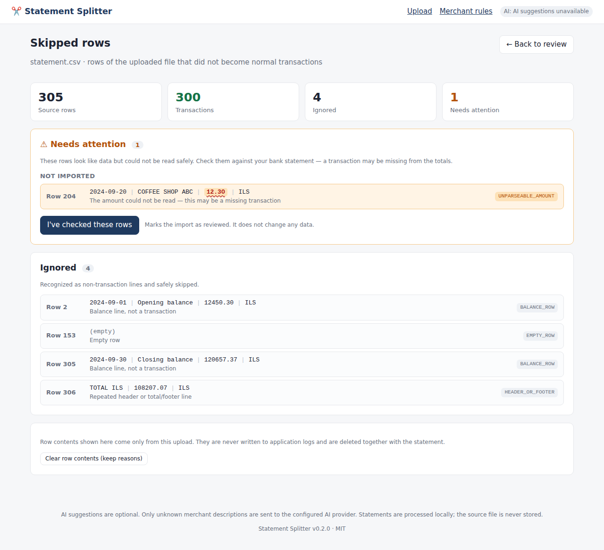

# Statement Splitter

**Turn messy bank statements into categorized expense reports — and teach the app your merchants as you go.**

Upload a bank statement → review categories → export a clean expense report.

[](https://github.com/VsevaTech/statement-splitter/actions/workflows/ci.yml)




## The problem

Freelancers, sole traders and small businesses get a CSV/XLSX export from their bank with hundreds of lines like

```
GOOGLE*GSUITE 839291
AWS EMEA 20481123
WOLT IL 551020
PARTNER COMMUNICATION 118203
CERCLI LTD 778812
UBER *TRIP 990112
```

and then spend an evening deciding, line by line, whether each one is *Software*, *Communication*, *Food*, *Transport*, a *bank fee*, *taxes* or just *personal*. Next month they do it again — for the same merchants.

Statement Splitter categorizes most lines automatically, puts the unknown ones in a short review queue, and **remembers every correction per merchant**, so the next statement is mostly done before you open it.

## Features

- **CSV and XLSX import** — any common delimiter (`,` `;` tab `|`), common encodings (UTF-8, Windows-1251/1255/1252…), Excel date cells.
- **Automatic column detection** (Date, Description, Amount *or* Debit/Credit, Currency, Dr/Cr indicator) with a fallback **column-mapping screen** and preview when detection is not confident.
- **Three-level categorization**: saved merchant rules → built-in keyword rules → optional AI fallback → *Needs review*.
- **Merchant learning**: correct a category once (or use *Apply to all similar*), and every future statement gets it automatically.
- **Review UI** with summary counters, filters (All / Needs review / Expenses / Income / Personal), inline category dropdowns, bulk apply.
- **XLSX export** with `Transactions` and `Summary` sheets; totals are **per category and per currency** — ILS, USD and EUR are never added together.
- **Financial integrity**: exact `Decimal` money end-to-end, an audit of every source row (nothing is dropped silently), and an optional statement balance check — *opening + net movement = closing*.
- **Optional, privacy-minded AI** (Gemini Flash free tier). Off by default; works fully offline without a key.
- Single SQLite file, no accounts, no background workers. Runs with `docker compose up`.

## Quick start

### Docker (recommended)

```bash
git clone https://github.com/VsevaTech/statement-splitter.git
cd statement-splitter
docker compose up --build
# open http://localhost:8000 and upload demo-data/statement.xlsx
```

### Local (Python 3.12+)

```bash
python -m venv .venv && source .venv/bin/activate
pip install -r requirements-dev.txt
cp .env.example .env            # optional — only needed for AI suggestions
uvicorn app.main:app --reload
```

The SQLite database is created at `./data/statement_splitter.db` (or `/data` inside Docker).

## Financial integrity

Statement Splitter is a review tool, not an accounting system — but the numbers it shows must be exactly the numbers in your file, and you must be able to see what it did *not* import.



### Exact money calculations

All monetary calculations use `Decimal` rather than binary floating point: parsing, the transaction model, SQLite storage, category and currency totals, balances, the JSON API and the XLSX export. `0.10 + 0.20 + 0.30` is `0.60`, not `0.6000000000000001`, and 4 000 one-cent transactions add up to exactly what they should.

- Amounts keep the scale they were written with (`12.30`, `1.234` for 3-decimal currencies) — the app does not assume two decimal places.
- SQLite has no decimal type, so amounts are stored as canonical **decimal text** (`"-12.40"`) through a SQLAlchemy type that refuses binary floats.
- A value that cannot be read (`12.3O`, `12abc`) is **never turned into 0** — the row is flagged instead.
- JSON returns money as decimal strings (`"difference": "0.00"`); the XLSX export writes numeric cells from the exact decimal text.

### Import audit

Rows that cannot be safely imported are never silently discarded. The import summary shows ignored and problematic rows with reasons. Every source row after the header gets exactly one outcome, and the counts always add up:

```
source rows = imported + ignored + not imported
```

| Outcome | Reason codes |
|---|---|
| **Ignored** (informational, safe) | `EMPTY_ROW`, `BALANCE_ROW`, `HEADER_OR_FOOTER` (repeated header, `TOTAL`/`Итого` line without a date), `ZERO_AMOUNT` |
| **Needs attention** — not imported, possibly a missing transaction | `UNPARSEABLE_AMOUNT`, `MISSING_AMOUNT`, `MALFORMED_ROW` (more cells than the header), `UNRECOGNIZED_ROW` |
| **Needs attention** — imported with a warning | `INVALID_DATE` (the money is imported, the unreadable date is flagged — as before, the row is not lost) |

The review page shows `300 / 305 rows imported · 4 ignored · 1 needs attention` and a **Review skipped rows** page where problem rows (amber, with the unreadable cell highlighted) are kept apart from safely ignored ones (grey). A row is only treated as a footer when it matches an explicit label and has no date — a merchant like `TOTAL ENERGIES` with a date is still a transaction; anything unknown is `UNRECOGNIZED_ROW`, never dropped. You can mark the import as reviewed.



Privacy: the review shows only rows of that upload. Raw rows are never logged; skipped-row contents are deleted together with the statement and can be cleared on their own (reason codes and counts stay).

### Balance reconciliation

When opening and closing balances are available, Statement Splitter can verify:

```
opening balance + net movement = closing balance        (per currency)
net movement = income (credits) − expenses (debits)
```

- Balances are **detected only from explicit lines** such as `Opening balance` / `Closing balance` / `Balance brought forward` / `Входящий остаток` carrying exactly one amount. If a label appears twice for a currency, nothing is guessed. No AI is involved.
- Detected balances are shown as *detected · row N* and can be confirmed or corrected; you can also type them in. Missing balances are reported as missing, never invented.
- Direction follows the app's existing semantics: the signed amount after Debit/Credit columns and Dr/Cr indicators are applied. Categories do not matter here — a *Personal* expense still moved money.
- Different currencies are never added together; a balance belongs to one currency and is reconciled only against that currency's transactions.

```
Opening balance       1,000.00 ILS
Income                  500.10 ILS
Expenses                300.50 ILS
Net movement           +199.60 ILS
Expected closing      1,199.60 ILS
Actual closing        1,187.20 ILS
Difference              -12.40 ILS   → Needs review
```

The JSON API exposes the same data: `GET /api/statements/{id}` (`import_summary`, `currency_totals`, `balance_check`, `balance_checks`) and `GET /api/statements/{id}/skipped-rows`.

## Try the demo

Everything in `demo-data/` is **synthetic** (generated by `scripts/generate_demo_data.py`, deterministic seed):

| File | Layout | Rows |
|---|---|---|
| `statement.csv` | `Date, Description, Amount, Currency` — signed amounts, comma delimiter; plus opening/closing balance lines, an empty row, a `TOTAL` footer and one malformed amount (`12.3O`) | 305 source rows → 300 transactions |
| `statement.xlsx` | the same month as `Transaction Date, Details, Debit, Credit, Currency, Balance` — Excel dates | 305 → 300 |
| `statement-2.csv` | next month, `;` delimiter, decimal comma, `dd.mm.yyyy` dates | 140 |
| `statement-balanced.csv` | opening 1000.00 + 500.10 − 200.20 − 100.30 = closing 1199.60 | difference `0.00` |
| `statement-unbalanced.csv` | the same with closing 1187.20 | difference `-12.40` |

`statement.csv` also contains tricky values (`0.10`, `0.20`, `0.30`, `123456.78`) and reconciles exactly in ILS.

Demo script:

1. Upload `statement.xlsx` (or `.csv`) → **Financial integrity**: `300 / 305 rows imported · 4 ignored · 1 needs attention` and *Statement balance reconciled · ILS — difference 0.00*. **Review skipped rows** shows the malformed `COFFEE SHOP ABC` amount apart from the balance/footer/empty lines. ~75 % of transactions are categorized automatically (Transport, Food, SaaS, Cloud, Bank fees, Taxes, Income, Personal…).
2. Click **Needs review** → the unknown merchants (`CERCLI`, `DOCUSIGN`, `TLV PRINTHOUSE`, …).
3. Pick *Accounting* for `CERCLI`, *Software / SaaS* for `DOCUSIGN`, *Office* for `TLV PRINTHOUSE` — with **remember** ticked, or press **Apply to all similar** to fix every occurrence at once. Each correction saves a merchant rule (see **Merchant rules**).
4. **Export categorized-expenses.xlsx**.
5. Upload `statement-2.csv` → the same three merchants are **categorized automatically** with source `rule`.
6. Upload `statement-unbalanced.csv` → *Statement balance difference · ILS −12.40 — Needs review*.

`python scripts/check_demo_integrity.py [base_url]` verifies these counts and differences deterministically (CI runs it in-process and against the Docker container).

This scenario is also an automated test: `tests/test_web_flow.py::test_demo_scenario_end_to_end` and `::test_critical_scenario_learned_merchant_applies_to_next_statement`.

## Supported input

- `.csv` / `.txt`: delimiter sniffed from the first lines; encoding detected (UTF-8 with/without BOM first, then Windows code pages via `charset-normalizer`).
- `.xlsx`: first sheet, via `openpyxl`; dates and numbers are read as typed cells.
- Amounts: `-46.80`, `1,234.56`, `1.234,56`, `1 234,56`, `1234,56`, `(12.00)`, `12.00-`, `12.00 DR` / `CR`, `1'234.50`, `₪ 45.90`, `12,50 EUR`. Only currency symbols/codes and Dr/Cr markers may surround the number; anything else makes the amount unreadable and the row is flagged. `-`/`—` in a Debit/Credit cell means empty. As before, one separator followed by exactly three digits is a thousands separator (`1,234` → 1234) and a single `.` is the decimal point (`1.234` → 1.234).
- Either one signed **Amount** column, or separate **Debit / Credit** columns, optionally a **Dr/Cr** indicator column.
- Currency from a column, from a symbol/code inside the amount cell, or a default you choose (ILS by default).

Rows that are not transactions are skipped **with a reason** — see [Import audit](#import-audit).

## Categories

```
Software / SaaS   Cloud / Hosting   Accounting   Communication
Transport         Travel            Office       Food
Bank fees         Taxes             Professional services
Personal          Other             Income (credits)
```

The list is closed: the UI dropdown, the built-in rules and the AI provider can only use these values (`app/categories.py`).

## How categorization works

```
saved merchant rule  (SQLite, your corrections)      → source: rule     confidence 1.0
credit / incoming    → Income                          → source: income
built-in regex rules (UBER→Transport, AWS→Cloud, …)   → source: builtin  confidence 0.8–0.9
AI fallback          (optional, unknown merchants only)→ source: ai       confidence from model
otherwise            → Needs review                    → source: unknown
```

A saved rule always wins — even over a built-in rule and even for credits.

### Merchant normalization

`app/normalize.py` turns a raw description into a stable **merchant key**:

```
GOOGLE*GSUITE 839291   →  GOOGLE GSUITE
GOOGLE GSUITE 482901   →  GOOGLE GSUITE
PAYPAL *SPOTIFY        →  SPOTIFY
CERCLI LTD 778812      →  CERCLI
MYSTERY SHOP 42        →  MYSTERY SHOP
```

It removes only clear noise: reference numbers, dates, masked card fragments, payment-processor prefixes (`PAYPAL *`, `SQ *`…), legal suffixes (`LTD`, `INC`…) and trailing branch numbers. It is deliberately conservative: there is no fuzzy matching, so `WOLT IL` and `WOLT DE` or `GOOGLE GSUITE` and `GOOGLE CLOUD` stay different merchants. Leaving something in review is preferred to merging two different merchants.

### Merchant learning

Changing a category with **remember** ticked, or pressing **Apply to all similar**, stores `merchant_key → category` in the `merchant_rules` table. Rules can be inspected and deleted on the **Merchant rules** page. Untick *remember* for one-off reclassifications (e.g. one Uber ride that was personal).

## Optional AI

Unknown merchants can be sent to **Gemini Flash** (Google AI Studio free tier) when — and only when — both are true:

1. `GEMINI_API_KEY` is set in the environment / `.env` (`GEMINI_MODEL` defaults to `gemini-2.0-flash`);
2. the **Use AI suggestions** switch is ON (stored in SQLite, **OFF by default**).

Without a key the UI shows `AI suggestions unavailable` and everything else works normally. The response is parsed with a Pydantic schema, categories outside the allowed list are discarded, and suggestions below `AI_MIN_CONFIDENCE` (0.6) stay in *Needs review*. Network errors, timeouts and malformed responses degrade to "no suggestion".

## Privacy

> AI suggestions are optional. Only unknown merchant descriptions are sent to the configured AI provider.

- The uploaded file is parsed in memory and never written to disk. Raw rows are kept in SQLite only until the column mapping is confirmed, then deleted; only the normalized transactions remain (you can delete a statement from the home page at any time).
- Statement contents are never logged; access logs are reduced and AI failures log only the exception class.
- The AI provider receives **normalized merchant keys of unknown merchants only** — no amounts, dates, balances, account details or the full statement. One batched request per upload.
- The API key lives in the environment only — never in the database; `.env` is git-ignored.
- Tests never call a real AI API (transport is injected).

## XLSX export

`GET /statements/{id}/export` → `categorized-expenses.xlsx`

**Transactions**: `Date | Original Description | Normalized Merchant | Amount | Currency | Direction | Category | Category Source`

**Summary**: `Category | Transaction Count | Total Amount | Currency` — one row per category **and** currency, so a statement with ILS, USD and EUR yields separate totals per currency. Uncategorized lines appear as `Needs review`. Below the table: **Import integrity** (source / imported / ignored / needing-attention rows) and, for each currency with balances, the **balance check** (opening, income, expenses, net movement, expected and actual closing, difference, status).

Amounts are numeric cells written from the exact decimals (`#,##0.00`, or more places when a value has them). Text cells starting with `=`, `+`, `-`, `@`, tab or CR are prefixed with `'` so a crafted description cannot become a spreadsheet formula.

## Architecture

```
app/
  main.py        FastAPI routes (upload → map → review → export), Jinja2 + HTMX
  services.py    use-cases shared by HTTP layer and tests
  importer.py    CSV/XLSX → RawTable (encoding + delimiter detection)
  columns.py     column detection + ColumnMapping model
  parsing.py     amount / date / currency parsers
  transform.py   RawTable + mapping → transactions + an outcome/reason for every source row
  normalize.py   merchant key normalization
  rules.py       built-in regex rules
  ai.py          optional Gemini client (injectable transport, Pydantic validation)
  categorize.py  rule > builtin > ai > review pipeline, summary
  money.py       Decimal helpers: exact conversion, sums, canonical text, display format
  integrity.py   import summary, per-currency totals, balance reconciliation
  export.py      openpyxl workbook (Transactions + per-currency Summary)
  db.py          SQLAlchemy 2 models (+ SkippedRow, StatementBalance), DecimalString type, SQLite migration
  templates/, static/
scripts/generate_demo_data.py   synthetic statements (deterministic)
scripts/check_demo_integrity.py deterministic demo integrity check (CI)
tests/                          pytest (170 tests), no network
```

Stack: Python 3.12, FastAPI, Pydantic v2, SQLAlchemy 2, SQLite, pandas, openpyxl, Jinja2 + HTMX, httpx, pytest, ruff, Docker.

## Tests

```bash
pytest            # 170 tests, ~8 s, no network / no AI key needed
ruff check .
ruff format --check .
```

Covered: CSV/XLSX import, delimiter and encoding detection, column detection and manual mapping, amount parsing, debit/credit, currencies, merchant normalization, built-in rules, saved rules (and their priority over built-ins), unknown merchants, AI disabled / malformed response / timeout / disallowed category, category correction, rule persistence, bulk apply, XLSX export, multi-currency summary, the full learn-then-reupload scenario and the demo scenario — plus Decimal arithmetic (0.1 + 0.2, 0.10 + 0.20 + 0.30 = 0.60, large values, many-row aggregation, category/currency totals, XLSX, SQLite round trip), every import-audit reason and count, balance detection and reconciliation (balanced, unbalanced, multi-currency, missing balances, manual entry), formula-injection escaping, no raw rows in logs and the v0.1 → v0.2 database migration.

Generated binaries (`demo-data/statement.xlsx`, `docs/*.png`) are rebuilt by `.github/workflows/bootstrap-assets.yml` whenever `docs/ASSETS_VERSION` changes; CI regenerates the demo data itself, so it never depends on a stale binary.

CI (`.github/workflows/ci.yml`): ruff check → ruff format → demo-data reproducibility → pytest → demo integrity check → Docker build + container smoke test + demo integrity check against the container.

## Database migration (v0.1 → v0.2)

There is no migration framework — for a single-file, self-hosted SQLite app a small, explicit, idempotent function is simpler to audit. On startup `app.db.migrate()`:

1. rebuilds `transactions` if `amount` is still a `REAL` column, copying `printf('%.2f', amount)` into the new decimal-text column (v0.1 always stored `round(amount, 2)`, so this recovers the exact intended value);
2. adds the new nullable columns (`statements.source_rows`, …, `pending_uploads.row_numbers_json`);
3. creates `skipped_rows` and `statement_balances` and sets `PRAGMA user_version = 2`.

Existing statements, transactions and merchant rules keep working. Statements imported before v0.2 show *Import audit not available* (their skipped rows were never recorded — re-upload the file to audit it). The rebuild runs in a transaction; back up `statement_splitter.db` first if it matters to you.

## Limitations

- Single-user, no authentication — run it locally or behind your own proxy.
- Only the first sheet of an XLSX is read; PDF statements are not supported.
- Column detection is heuristic; unusual layouts fall back to manual mapping.
- Built-in rules are a small, mostly English/Israeli-flavoured starter set — the app is meant to learn *your* merchants, not to ship a merchant database.
- Merchant normalization is exact-key, not fuzzy: `GOOGLE GSUITE` and `GOOGLE WORKSPACE` are two merchants until you teach both.
- Balances are detected only from explicitly labelled lines; a running-balance column is not used to infer opening/closing balances (row order in bank exports is not reliable) — enter them manually in that case.
- A spreadsheet *formula* result is read as the binary float Excel stored (e.g. `0.30000000000000004`); typed values and CSV text are exact.
- The balance check shows that the import is consistent with the statement's own balances; it is not an accounting reconciliation against the bank.
- No multi-currency conversion: totals are reported per currency by design.
- AI fallback depends on Gemini free-tier quotas and returns nothing on rate limits.

## License

MIT — see [LICENSE](LICENSE).
